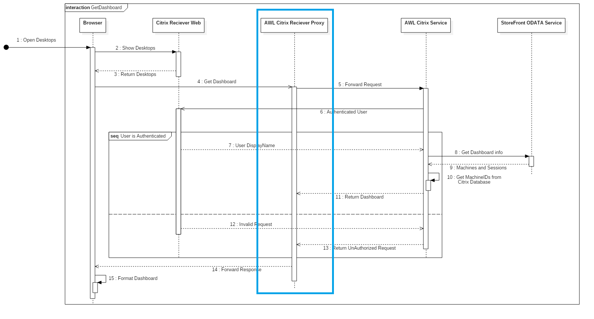

AWL Citrix Reciever Proxy
=========================

[AWL Citrix Reciever Proxy] is a simple reverse proxy handler for the Citrix Reciever Web. It forwards the request from the StoreFront page to an static endpoint url that can be configured in the proxy. With the proxy it's possible to call an internal web service from an external client or from an internal client without dealing with [cross-origin HTTP requests](https://developer.mozilla.org/en-US/docs/Web/HTTP/Access_control_CORS).



## Overview

* [Installation](#installation)
* [Configuration](#configuration)
* [Usage](#usage)

## Installation

After building the project in Visual Studio you'll need to copy `AWLServiceProxyHandler.ashx` from the `bin\` directory to the `C:\inetpub\wwwroot\Citrix\<storename>Web\` directory on the StoreFront server. The binary `AWL.Citrix.Reciever.Proxy.dll` from the `bin\` directory needs to be placed in the `C:\inetpub\wwwroot\Citrix\<storename>Web\bin` directory also on the StoreFront server.

## Configuration

The endpoint address can be changed by edititing the `EndPointUrl` property in `AWLServiceProxyHandler.ashx.cs` 

```
public const string EndpointUrl = "https://SERVERNAME/citrix";
```

## Usage

You can call the `AWLServiceProxyHandler.ashx` handler from your custom JavaScript in the Citrix Web Reciever.

```
CTXS.ExtensionAPI.proxyRequest({
    url: "AWLServiceProxyHandler.ashx/dashboard"
});
```

The proxy will call (including request headers, cookies and parameters) to the configured endpoint. So calling `AWLServiceProxyHandler.ashx/dashboard` the proxy will call the following address

```
https://SERVERNAME/citrix/dashboard
```

#### Warning

The